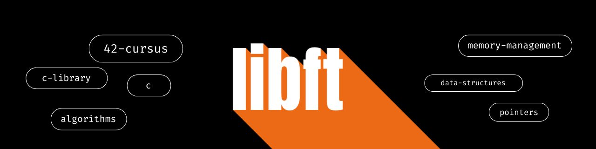

<div align="center">

  

  <br>

  
  
  
  

  

  <p align="center">
    <b>A custom C library implementing essential standard functions and additional utilities.</b><br>
    Built from scratch to understand the primitives of memory and string manipulation.
  </p>

</div>

---

## 📜 The Context

> *"Before relying on high-level abstractions, one must understand the primitives."*

The **libft** project is the cornerstone of the 42 curriculum. The goal is to recreate functions from the C standard library (`libc`) and develop additional utilities that will be used in almost every future C project.

By compiling these functions into a static library (`libft.a`), we build a reusable, well-tested, and optimized toolkit that handles memory allocation, string parsing, and data structures.


## 🧩 The Modules

The development of this library is divided into two distinct engineering phases:
1. **The Mandatory Core:** Re-engineering standard `libc` functions and creating essential string/memory utilities.
   
2. **The Bonus Expansion:** Introducing singly linked lists (`t_list`) to handle dynamic data structures.

Click to decrypt the logic behind each build.

---


<details>
<summary><b>🔹 Module I: The Core ( Mandatory ) </b></summary>

<br>

> *The mandatory section is the core of the project, establishing the base functions required to operate with strings, memory, and output streams without relying on external libraries.*

#### ⚙️ Part 1: Libc Functions
These functions replicate standard C library behaviors exactly as described in their `man` pages. They are the core building blocks for parsing and memory operations.

---

<details>
<summary><b>📂 View Libc Catalog</b></summary>

<br>

| Function | Prototype | Technical Description |
| :--- | :--- | :--- |
| `ft_isalpha` | `int ft_isalpha(int c);` | Checks if the character is alphabetic. |
| `ft_isdigit` | `int ft_isdigit(int c);` | Checks if the character is a digit. |
| `ft_isalnum` | `int ft_isalnum(int c);` | Checks if the character is alphanumeric. |
| `ft_isascii` | `int ft_isascii(int c);` | Checks if the character is in ASCII range. |
| `ft_isprint` | `int ft_isprint(int c);` | Checks if the character is printable. |
| `ft_strlen` | `size_t ft_strlen(const char *s);` | Returns the length of a string. |
| `ft_memset` | `void *ft_memset(void *b, int c, size_t len);` | Fills memory with a constant byte. |
| `ft_bzero` | `void ft_bzero(void *s, size_t n);` | Sets a byte string to zero. |
| `ft_memcpy` | `void *ft_memcpy(void *dst, const void *src, size_t n);` | Copies memory area (without overlap handling). |
| `ft_memmove` | `void *ft_memmove(void *dst, const void *src, size_t len);` | Copies memory area safely (handles overlapping). |
| `ft_strlcpy` | `size_t ft_strlcpy(char *dst, const char *src, size_t dstsize);` | Size-bounded string copying. |
| `ft_strlcat` | `size_t ft_strlcat(char *dst, const char *src, size_t dstsize);` | Size-bounded string concatenation. |
| `ft_toupper` | `int ft_toupper(int c);` | Converts a lower-case letter to upper-case. |
| `ft_tolower` | `int ft_tolower(int c);` | Converts an upper-case letter to lower-case. |
| `ft_strchr` | `char *ft_strchr(const char *s, int c);` | Locates the first occurrence of a character in a string. |
| `ft_strrchr` | `char *ft_strrchr(const char *s, int c);` | Locates the last occurrence of a character in a string. |
| `ft_strncmp` | `int ft_strncmp(const char *s1, const char *s2, size_t n);` | Compares two strings up to `n` characters. |
| `ft_memchr` | `void *ft_memchr(const void *s, int c, size_t n);` | Locates the first occurrence of a byte in a memory block. |
| `ft_memcmp` | `int ft_memcmp(const void *s1, const void *s2, size_t n);` | Compares byte strings. |
| `ft_strnstr` | `char *ft_strnstr(const char *haystack, const char *needle, size_t len);` | Locates a substring in a string. |
| `ft_atoi` | `int ft_atoi(const char *str);` | Converts an ASCII string to an integer. |
| `ft_calloc` | `void *ft_calloc(size_t count, size_t size);` | Allocates and zero-initializes contiguous memory. |
| `ft_strdup` | `char *ft_strdup(const char *s1);` | Duplicates a string using dynamic memory allocation. |

</details>

---

#### 🛠️ Part 2: Additional Utilities
These functions extend the standard library, providing convenient heap-allocated string manipulation and secure I/O operations.

---

<details>
<summary><b>📂 View Utilities Catalog</b></summary>

<br>

| Function | Prototype | Technical Description |
| :--- | :--- | :--- |
| `ft_substr` | `char *ft_substr(char const *s, unsigned int start, size_t len);` | Allocates and returns a substring from the string `s`. |
| `ft_strjoin` | `char *ft_strjoin(char const *s1, char const *s2);` | Allocates and returns a new string, result of the concatenation of `s1` and `s2`. |
| `ft_strtrim` | `char *ft_strtrim(char const *s1, char const *set);` | Allocates and returns a copy of `s1` with characters specified in `set` removed from the edges. |
| `ft_split` | `char **ft_split(char const *s, char c);` | Allocates and returns an array of strings obtained by splitting `s` using the character `c` as a delimiter. |
| `ft_itoa` | `char *ft_itoa(int n);` | Allocates and returns a string representing the integer received as an argument. |
| `ft_strmapi` | `char *ft_strmapi(char const *s, char (*f)(unsigned int, char));` | Applies function `f` to each character of the string `s` to create a new mapped string. |
| `ft_striteri` | `void ft_striteri(char *s, void (*f)(unsigned int, char*));` | Applies function `f` to each character of the string passed by pointer. |
| `ft_putchar_fd` | `void ft_putchar_fd(char c, int fd);` | Outputs the character `c` to the given file descriptor. |
| `ft_putstr_fd` | `void ft_putstr_fd(char *s, int fd);` | Outputs the string `s` to the given file descriptor. |
| `ft_putendl_fd` | `void ft_putendl_fd(char *s, int fd);` | Outputs the string `s` to the given file descriptor, followed by a newline. |
| `ft_putnbr_fd` | `void ft_putnbr_fd(int n, int fd);` | Outputs the integer `n` to the given file descriptor. |

</details>

---


</details>


---


<details>
<summary><b>🔸 Module II: Dynamic Topologies ( Bonus )</b></summary>

<br>

> *The bonus section introduces **singly linked lists (`t_list`)**, establishing the foundation for dynamic memory management and pointer handling in more complex algorithms.*


#### 🧬 Part 3: Linked Lists
Dynamic memory allocation and node linking for advanced data management.

---

<details>
<summary><b>📂 View Linked List Catalog</b></summary>

<br>

| Function | Prototype | Technical Description |
| :--- | :--- | :--- |
| `ft_lstnew` | `t_list *ft_lstnew(void *content);` | Allocates and returns a new node. The member variable `content` is initialized with the value of the parameter. |
| `ft_lstadd_front` | `void ft_lstadd_front(t_list **lst, t_list *new);` | Adds the node `new` at the beginning of the list. |
| `ft_lstsize` | `int ft_lstsize(t_list *lst);` | Counts the number of nodes in a list. |
| `ft_lstlast` | `t_list *ft_lstlast(t_list *lst);` | Returns the last node of the list. |
| `ft_lstadd_back` | `void ft_lstadd_back(t_list **lst, t_list *new);` | Adds the node `new` at the end of the list. |
| `ft_lstdelone` | `void ft_lstdelone(t_list *lst, void (*del)(void *));` | Takes as a parameter a node and frees the memory of the node's content using the function `del` given as a parameter. |
| `ft_lstclear` | `void ft_lstclear(t_list **lst, void (*del)(void *));` | Deletes and frees the given node and every successor of that node. |
| `ft_lstiter` | `void ft_lstiter(t_list *lst, void (*f)(void *));` | Iterates the list `lst` and applies the function `f` to the content of each node. |
| `ft_lstmap` | `t_list *ft_lstmap(t_list *lst, void *(*f)(void *), void (*del)(void *));` | Iterates the list `lst` and applies the function `f` to the content of each node. Creates a new list resulting from the successive applications of `f`. |

</details>


</details>

---

## 🏗️ System Architecture

The project operates as a **Static Library Collection**. By decoupling the functions into individual object files during compilation, it ensures that any software linking to `libft.a` only includes the necessary binary code, minimizing the final executable footprint.

### 🧪 Testing & Validation

This library has been rigorously tested to ensure no memory leaks and strict adherence to standard behaviors. 
* **Static Analysis:** Validated by **Norminette** (42's internal linter).
* **Compiler Flags:** Compiled strictly with `-Wall -Wextra -Werror`.
* **Dynamic Testing:** Verified against comprehensive external test suites to guarantee edge-case safety.

---
## 💻 Compilation & Usage

### ⚡ Installation

To compile the library, ensure you have a C compiler (`gcc` or `clang`) and `make` installed.
Clone the repository:

```bash
git clone [https://github.com/joolibar/libft.git](https://github.com/joolibar/libft.git)
cd libft
```
Compile the library:

```bash
make        # Compiles the Mandatory functions
# OR
make bonus  # Compiles both Mandatory and Bonus functions
```

### 🛠️ Usage

Once compiled, a static library archive `libft.a` is generated. You can link it to your C projects in two ways:

#### 1. Manual Compilation (Quick Start)
Include the header in your `.c` files and link the binary during compilation:

```c
#include "libft.h"
```

Compile your project with the library:

```bash
gcc -Wall -Wextra -Werror your_file.c -L. -lft -o your_program
```

#### 2. Professional Integration (Makefile)

The most efficient way to use **libft** in large-scale projects is by integrating it directly into your `Makefile`. This ensures the library is built as a dependency of your project.

```makefile

# Path variables
NAME        = my_project
LIBFT_DIR   = ./libft
LIBFT       = $(LIBFT_DIR)/libft.a

# Compiler configuration
CC          = gcc
CFLAGS      = -Wall -Wextra -Werror -I$(LIBFT_DIR)

all: $(NAME)

# Rule to compile your project linking libft
$(NAME): $(OBJS) $(LIBFT)
	$(CC) $(OBJS) $(LIBFT) -o $(NAME)

# Rule to build libft if it doesn't exist or has changed
$(LIBFT):
	make -C $(LIBFT_DIR)

clean:
	rm -f $(OBJS)
	make -C $(LIBFT_DIR) clean

fclean: clean
	rm -f $(NAME)
	make -C $(LIBFT_DIR) fclean

re: fclean all

```

---

<div align="center">
  
  <br>
  <i>"We write code to understand how the machine thinks. But we tell stories to help humans understand." </i> 🧠📖
  <br><br>

  <strong>Found this library useful?</strong>
  <br>
  <a href="https://github.com/joolibar/So_long/stargazers"><strong>⭐ Drop a star</strong></a> 
  &nbsp;|&nbsp;
  <a href="https://github.com/joolibar"><strong>👀 Follow my journey</strong></a>
  <br><br>

  <a href="https://github.com/joolibar">
     
  </a>
  <br>
  
  <span>Crafted by <strong>joolibar</strong></span>
  <br>
  <small><samp>Creative Developer building digital experiences at 42</samp></small>

  <a href="https://github.com/joolibar">
    
  </a>
  &nbsp;
  <a href="https://www.linkedin.com/in/jon-olibares-arana/">
    
  </a>
  &nbsp;
  <a href="https://github.com/joolibar/42-journey">
    
  </a>

  <br>
  <sub>
    © 2024 joolibar &nbsp;•&nbsp; Validated by Moulinette 🤖, crafted by Humans 🧠.
  </sub>

</div>